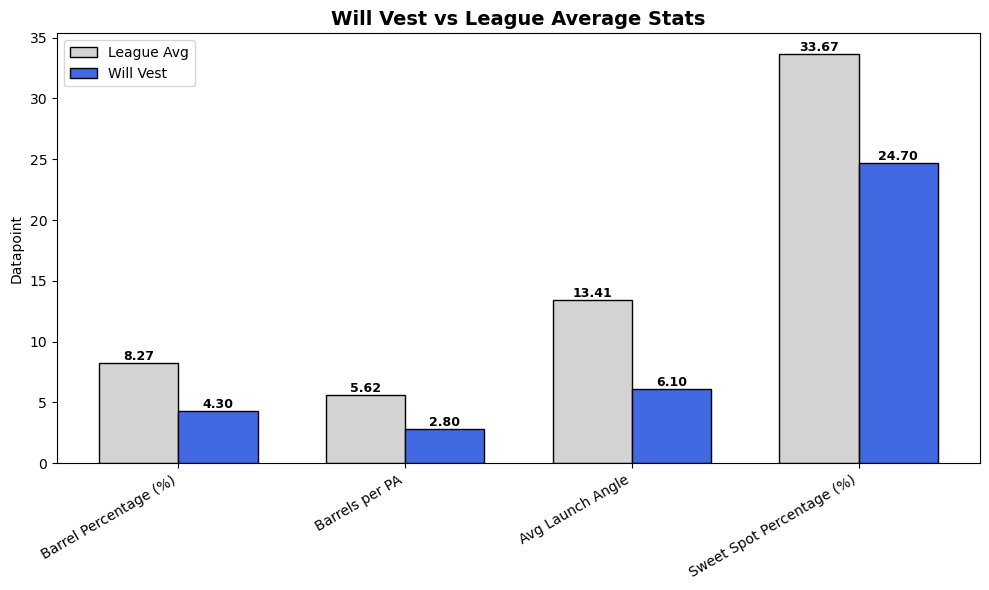
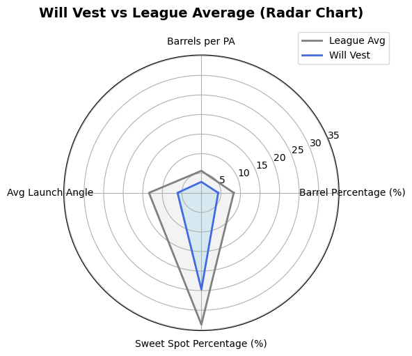

# Will Vest - DET relief pitcher
Pitching Stats Compared Against League Averages

Creating both a bar chart and radar graph to compare Will Vest's numbers against league averages.

Stats: 

•	Barrel Percentage (%)

•	Barrel Per Plate Appearance

•	Average Hit Angle

•	Angle Sweet Spot Percentage (%)

## Template
Can be used for any pitcher from 2025 season by adjusting the name selected from the csv file.
